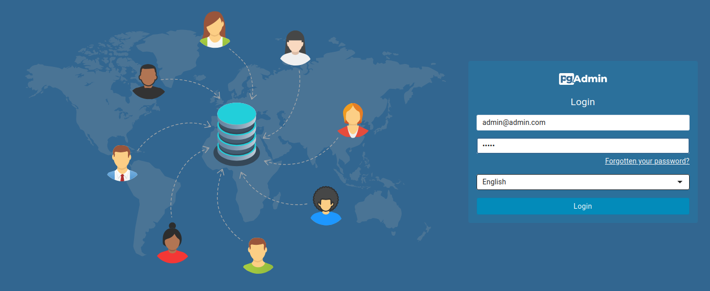
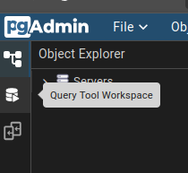
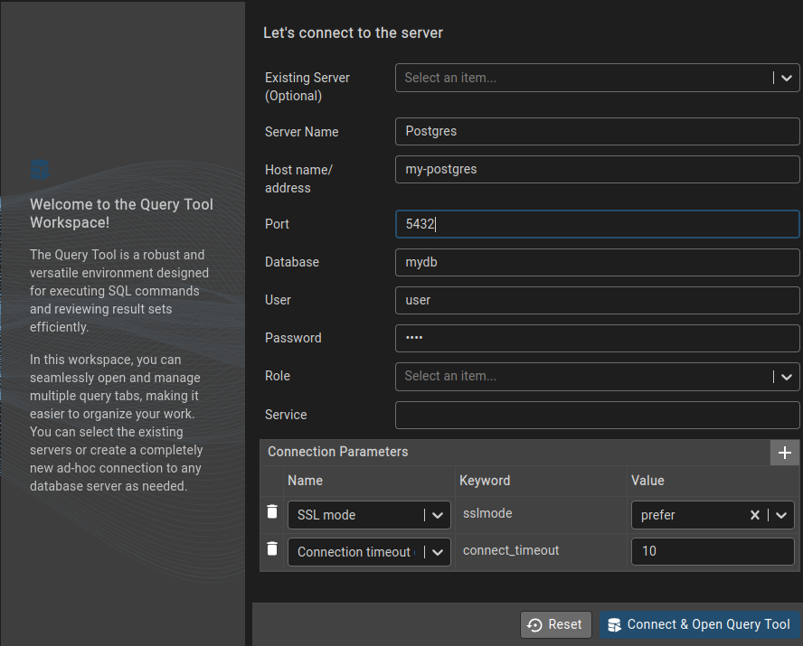
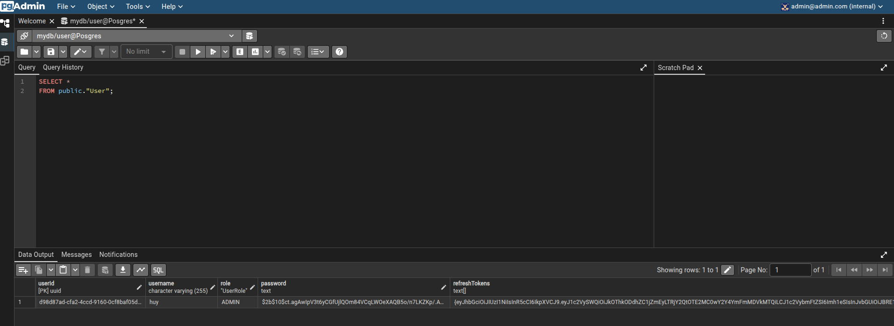

# Smart parking system website

## ⇁ GUIDE TO RUN PROJECT (ONLY WEB PARTS)

- Clone this project<br>
- Run docker compose file:

```bash
docker-compose up -d
```

- Migrate DB and make seed data:

```bash
    docker exec -it sps-express-server-container sh -c "
    npx prisma migrate deploy --schema=./prisma/schema.prisma &&
    npx prisma generate --schema=./prisma/schema.prisma &&
    node dist/prisma/seed.js
    "
```

## PGADMIN TUTORIAL

- Go to [http://localhost:8081]
  <br/>
- Enter the email, password which are specified as environment variables for pgadmin service in [docker-compose file](docker-compose.yml)
  <br/>
  

- Next, click "Query Tool Workspace"
  <br/>
  

- Finally, connect to the database by entering the values you specified as environment variables for postgres service in [docker-compose file](docker-compose.yml)
  <br/>
  

### Some basic/useful SQL queries:

- List all tables:

```SQL
SELECT table_name
FROM information_schema.tables
WHERE table_schema = 'public'
ORDER BY table_name;
```

- Get all users:

```SQL
SELECT *
FROM public."User";
```

  <br/>
  
