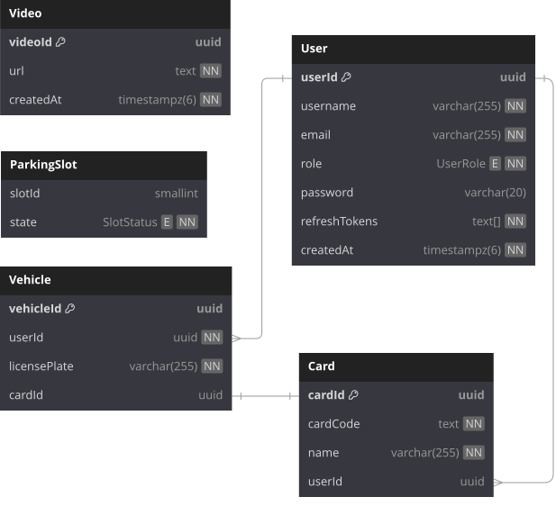

# SPS apis


||

BE server for [Smart parking system website](./templates/.env.template). This project uses Expressjs, Typescript and Socket.io

**_CT6_**

||

---

## ⇁ List of environment variables

| Variable          | Required | Purpose                                                                                      |
| ----------------- | -------- | -------------------------------------------------------------------------------------------- |
| DATABASE_URL      | YES      | your choosen database url                                                                    |
| AT_SECRET_KEY     | YES      | use to generate, verify accesstoken                                                          |
| RT_SECRET_KEY     | YES      | use to generate, verify refreshtoken                                                         |
| PORT              | NO       | port to run project, it is set to `8000` by default                                          |
| NODE_ENV          | NO       | environment, can take value of `development` or `production`, default value is `development` |
| CLIENT_DOMAIN     | NO       | client domain, need to specify to pass CORS                                                  |
| CLIENT_PORT       | NO       | client port, like `CLIENT_DOMAIN` but used to develop in local                               |
| CAMERA_SERVER_API | YES      | server that connects with camera to detect license plate                                     |

For the full .env file example, check
out [this template](./templates/.env.template) <br>

## ⇁ GUIDE TO RUN PROJECT

-   Clone this project<br>
-   Go to express-server folder:

```shell
cd ./express-server/
```

-   Config your .env file (or use [the default one](./.env) is ok)<br>

-   Install all dependencies:

```shell
npm i
```

-   Pull postgresql image and run container instantlly

```shell
docker run --name my-postgres \
  -e POSTGRES_USER=user \
  -e POSTGRES_PASSWORD=user \
  -e POSTGRES_DB=mydb \
  -p 5433:5432 \
  -d postgres:15
```

-   push schema to db (when it requires you to input migration name, type whatever you like)

```shell
npm run db-push
```

-   get into "my-postgres" container

```shell
docker exec -it my-postgres bash
psql -U user -d mydb
```

-   insert admin account (password is "123123", you can change username, email whatever you like but should not change password and role)

```sql
INSERT INTO public."User" ("username", "role", "password", "email") VALUES ('huy', 'ADMIN', '$2a$10$46gjWmqu30PRtRMHkcik.uW5USI3hCkdTflKs9g/oEJHb3TVrk4CO', 'huy@gmail.com');
```

-   Get back to /express-server folder by typing `exit` two times
-   Run server in dev mode

```shell
npm run dev
```

-   ngrok (must be specified for the camera server to be reachable):

```shell
ngrok http --url=<your-ngrok-static-domain> 4000
```

## ⇁ BASIC POSTGRESQL STATEMENTS

-   get into "my-postgres" container

```shell
docker exec -it my-postgres bash
psql -U user -d mydb
```

-   To list all tables:

```shell
\dt
```

-   To view a table structure (notice that in a table name which contains upper-case characters must be put in double quotes):

```shell
\d public.<table-name>
```

-   To view all records in a table (notice that all statements must be ended with semicolon)

```shell
SELECT * FROM public.<table-name>;
```

## ⇁ Commands for development

if you change some relations in [schema.prisma](./src/prisma/schema.prisma) file, you can regenerate

```shell
npm run db-generate
```

you can check the invalid code with this command:

```shell
npm run lint
```

## ⇁ Database schema



## ⇁ Deploy

```shell
make build
make server
```
